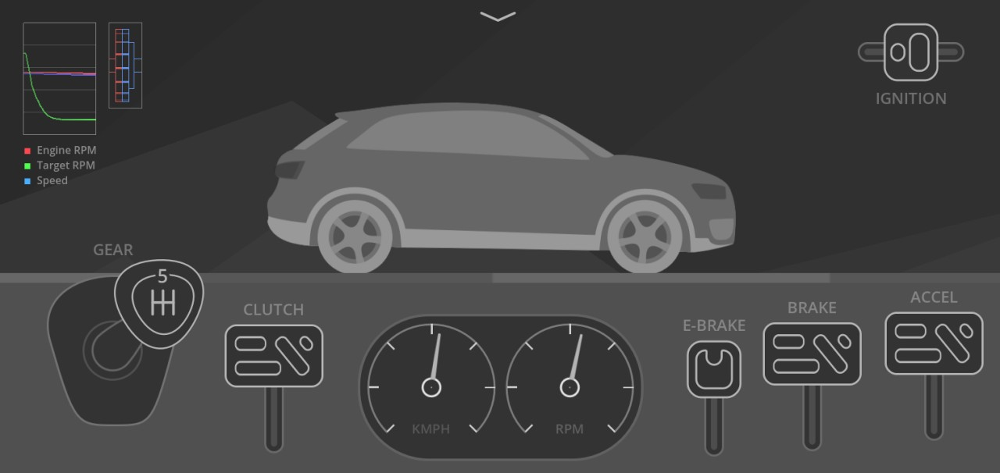

# Broken Wheels

Broken Wheels is a 2D car simulator with manual transmission mechanics.
It is designed in a flat, minimalistic grayscale style.

The game is in its early stages and may have issues.
Furthermore, breaking changes are made often.

## Features

 - Gearshift (up to fifth gear)
 - Clutch, brake, accelerator, and ignition control
 - Infinite flat and curved terrain
 - Engine stalling
 - Engine sounds (incomplete)

## Screenshots

## Setup

 - Godot 4.x required
 - Clone the repository and import the project.godot file

## To-do

 - Fix car logic
 - Complete engine sounds
 - Add more options to settings
 - Start guide for controls
 - Gear box overview
 - Shaders

## Note

This game is not intended to be a realistic simulation of cars gearbox mechanics, and it should not be used as such.
This is a mobile game made for fun and knowledge.
Contributions are welcome.

## License

MIT License © 2023 [devendrn](https://github.com/devendrn)
